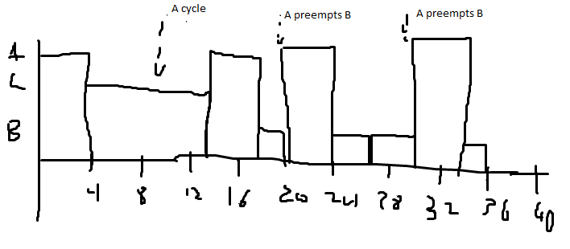
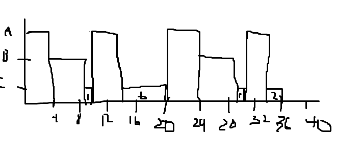

# Question 1

## Total loading time

The total time loading or utilization is the sum of all task utilizations

U_1 = 4ms/10ms = 0.4
U_2 = 12ms/39ms = 0.3076
U_3 = 98ms/1000ms = 0.098
U = U_1 + U_2 + U_3
= 0.8056
80.56%

## RMS feasibility

The task must have a total utilization less than

3*(2^(1/3)-1)*100% = 77.97% < 80.56%

This means an RMS schedual is not feasibile.

## Making the RMS scheduale feasibile

The easiest way of making the task a feasible schedule depends on the problem these tasks are solving.

There are three potential approaches:

### Lowering the WCET of the highest utilization task.

In this case task 1 would be candidate.

You would only have to shorten the utilization by 80.56 - 77.97 = 2.59%

Thus the maximum WCET of task 1 must be

WCET/10ms = 0.4-0.0259
WCET = 3.741ms

It would only need to be sped up by a factor of 1 - 3.741ms/4ms = 0.06475 = 6.457%

This may not be feasible however if the task is already very optimized due to it's already low execution time

### Lowering the WCET of the longest WCET task

Usually longer tasks are easier to optimize, thus task 3 would be the target

We'd need to speed up that task by

WCET/1000ms = 0.098-0.0259
WCET = 72.1ms
98ms - 72.1ms = 25.9ms

25.9ms/98ms = 26.42%

This is a larger percentage than alternative 1, but it could be easier since longer running tasks have more opportunities for optimization.

### Increasing the period to get harmonic schedualing

This is the **easiest** method assuming the requirements don't make it infeasible. (For ex, if the period was there to support a standard baud rate)

All we'd have to do is increase the period of task 2 to be 1ms longer. Then we'd have periods of 10, 40, and 1000 which is harmonic (1000/40 = 25, 1000/ 10 = 100, 40/10 =4)

Since harmonic periods only need to have a total utilization of less than 100%, we'd have it RMS scheduable

# Question 2

## Part a

### System utilization

U_a = 4ms/10ms = 0.4
U_b = 5ms/20ms = 0.25
U_c = 10ms/40ms = 0.25
U = 0.9 = 90%

### Is it RMS scheduled

No because the shorter periods must have the highest priority. Task B and C need to have their priorities swapped for RMS scheduability.

### Task response times

Ra = 4ms

Assume Rc = 10ms

Rc_1 = 10ms + |10ms/10ms| \* 4ms = 14ms
Rc_2 = 10ms + |14ms/10ms| \* 4ms = 18ms
Rc_3 = 10ms + |18ms/10ms| \* 4ms = 18ms

Rc = 18ms

Assume Rb = 5ms

Rb_1 = 5ms + |5ms/10ms| \* 4ms + |5ms/40ms| \* 10ms = 19ms
Rb_2 = 5ms + |19ms/10ms| \* 4ms + |19ms/40ms| \* 10ms = 23ms
Rb_3 = 5ms + |23ms/10ms| \* 4ms + |23ms/40ms| \* 10ms = 27ms
Rb_4 = 5ms + |27ms/10ms| \* 4ms + |27ms/40ms| \* 10ms = 27ms

Rb = 27ms

### Task deadlines

Task A
4ms < 10ms
It beats it by 6ms

Task B
27ms > 20ms
It misses it by 7ms

Task C
18ms < 40ms
It beats it by 22ms

### Execution time line

## Part B

### System utilization

U_a = 4ms/10ms = 0.4
U_b = 5ms/20ms = 0.25
U_c = 10ms/40ms = 0.25
U = 0.9 = 90%

### Task response times

Ra = 4ms

Assume Rb = 5ms

Rb_1 = 10ms + |5ms/10ms| \* 4ms = 14ms
Rb_2 = 10ms + |14ms/10ms| \* 4ms = 18ms
Rb_3 = 10ms + |18ms/10ms| \* 4ms = 18ms

Rb = 18ms

Assume Rc = 10ms

Rb_1 = 5ms + |10ms/10ms| \* 4ms + |10ms/20ms| \* 5ms = 19ms
Rb_2 = 5ms + |19ms/10ms| \* 4ms + |19ms/20ms| \* 5ms = 23ms
Rb_3 = 5ms + |23ms/10ms| \* 4ms + |23ms/20ms| \* 5ms = 32ms
Rb_4 = 5ms + |32ms/10ms| \* 4ms + |32ms/20ms| \* 5ms = 36ms
Rb_5 = 5ms + |36ms/10ms| \* 4ms + |36ms/20ms| \* 5ms = 36ms

Rb = 36ms

### Task deadlines

Task A
4ms < 10ms
It beats it by 6ms

Task B
18ms < 20ms
It beats it by 2ms

Task C
36ms < 40ms
It beats it by 4ms

### Execution time line

